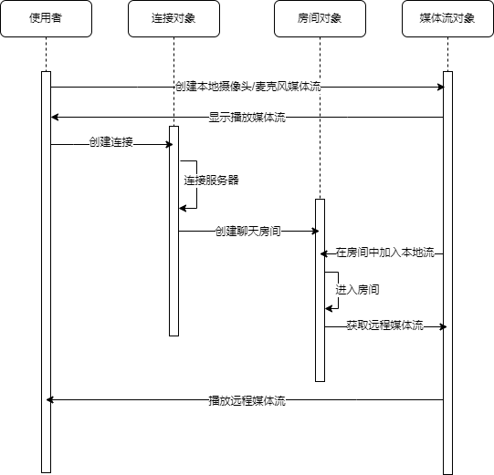

# vue集成lib-jitsi-meet


项目基于`lib-jitsi-meet`框架下开发，本来我都以为是一件非常简单的事情，但不幸的是由于开发文档能够参考的资料极少，同时官网只有一个API文档连个像样的示例都没有给出来导致搞这个示例非常伤。

同时由于`jitsi-meet`后端涉及到的服务与`xmpp`等协议本身就不是很熟悉所以探索过程走了不少的弯路，非常难受。不过经过一系列的探索算是把基础的示例代码给搞定了，下面大致说一下集成到VUE的部分问题。

## 1.后端部署问题

后端我部署在K8S上面，根据能够找到的方案，最简单的方式是采用一个开源的Helm仓库：[地址](https://github.com/tan9710630/jitsi-helm)。通过配置Helm值的应答就能得到一个能够运行的后端，问题在于原始项目的描述简直就是说了一个寂寞，如果你仅仅按照他描述的来绝对跑不通，正确的配置大概是这样：

```yaml
# 这里是负载均衡到web服务80端口的地址，必须是https且只能指向80端口
publicURL: "https://jitsi.xunshi.com"
# 时区，没有什么好说的
tz: Asia/Shanghai
# 这里也是web服务的域名，本质上是由web服务去代理xmpp，所以不需要给prosody服务配置负载均衡
xmpp.domain: jitsi.xunshi.com
# 这里是一个重点，他原始文档说了半天也就是这里，主要原因是不同于XMPP通过web来的，这里的jvb服务需要直接对外提供服务
# 具体方式也就是他原文里面说的几种方案，从K8S集群角度考虑最靠谱的还是NodePort，特别注意需要修改UDPPort和TCPPort
# 默认情况下K8S能够开放的NodePort在30000-32000所以一定要是这个范围
# 这里如果没有对外提供端口则会出现超过3个会议情况下无法共享视频
jvb:
  service:
    type: NodePort
  UDPPort: 30001
  TCPPort: 30002
  publicIP: 192.168.0.112
```

服务创建完毕之后手动给个负载均衡到web上面去就OK了，这里还有一个问题是XMPP的`WebSocket`需要允许跨域访问，所以需要加入一个配置，在prosody配置之中加入`XMPP_CROSS_DOMAIN=true`即可。

## 2.配置问题

根据官网的描述与`JitsiMeet`的部署文档来看对`lib-jitsi-meet`的配置大体只需要下面这样就能正常运行：

```json
{
    hosts: {
        domain: "域名",
        muc: "muc域名",
    },
    serviceUrl: "XMPP的URL"
}
```

但是如果直接将负载均衡的域名与URL配置上去创建连接时`WebSocket`或报错403，别问我怎么知道了。通过对web项目的请求参数发现这里hosts里面配置的域名其实不被prosody信任，所以连接会失败。解决方案是将hosts里面的`domain`和`muc`配置为prosody的`XMPP_DOMAIN`和`XMPP_MUC_DOMAIN`值相同即可。

## 3.JQuery问题

这里由于原始的`@lyno/lib-jitsi-meet`之中本来就有JQ，但是我在封装时大量使用了箭头函数导致作用域偏移没有JQ对象，这里的解决方案是直接给index.html加入JQ的引用，没有办法的办法了算是，但是也解决了问题。

## 4.框架使用

其实本身倒不是多么的复杂主要原因还是无论是官方的还是社区的文档都非常破碎，想要啃下来还是比较麻烦，这里我简单整理一下，无非就是下面几个东西：

- `JitsiConnection`：对服务器连接对象，连接的生命周期管理等一系列功能是这个对象负责，包含大量的回调钩子可以监听。
- `JitsiConference`：会议房间的对象，房间的生命周期管理在这里完成，里面也有大量的监听回调。
- `JitsiTrack`：媒体流对象，视频、音频的生命周期在这里完成，里面也有监听回调。

这里可以通过一个序列图说明会议生命周期并且阐释三者之间的关系：



这样一来就算是将多人音视频聊天的基础逻辑说明白了，具体的代码可以参考项目内部的代码，这里就不废话了，具体关键地方的注解都写的比较清楚，可以快速上手。同时房间的回调可以监控大量的数据传输，甚至可以自定义协议完成部分通讯指令，这里就说一下简单的例子：

参会人员A可以发送消息给房间对象，其他加入到房间的参会人员能够通过消息监听回调函数得到A发送的消息，这样一样多人文字聊天室完全搞出来，或者将消息指令化，A按下了一个按钮，其他参会者接收的指令后执行特定的操作，这个甚至可以做多人游戏。。。。

## 5.SSL证书问题

这里一定要特别注意，你本地是没有SSL证书的也就是无法发起https请求，这样一来浏览器会禁止调用摄像头或者麦克风，但是WebRTC支持使用localhost使用http进行调用，所以不能使用内网IP访问，开发的时候必须用localhost。
